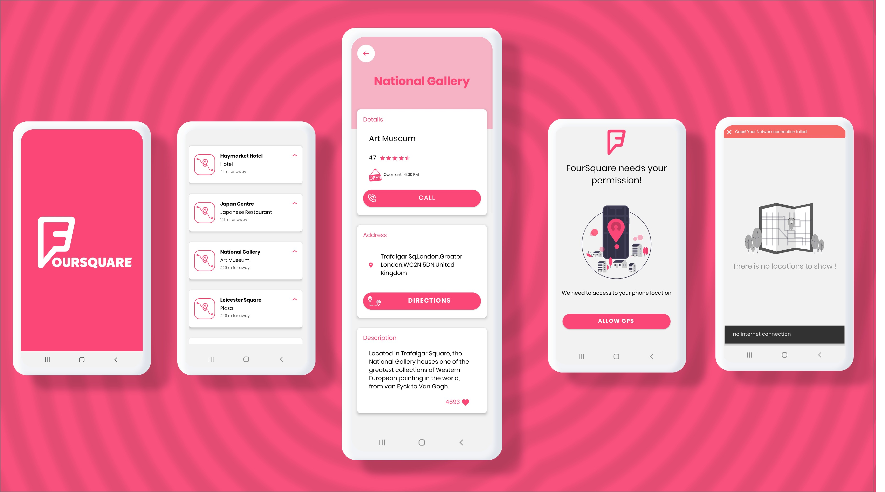
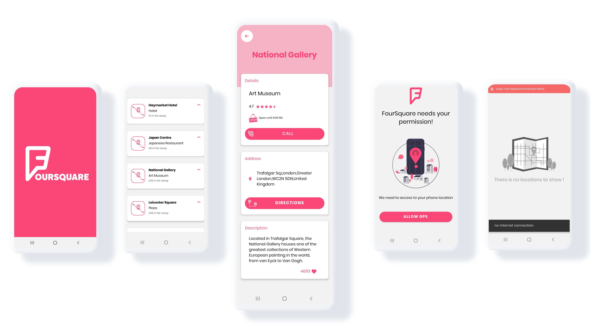

Android-MVI-Sample-FourSquare
=========================

Android-MVI-Sample-FourSquare forked project from [Foursquare](https://github.com/sepehrs3ep/FourSquare) that implemented the whole project via MVI architecture

Introduction
------------

The application uses Clean Architecture and Respository Pattern on Core Layer and  MVI on Presentation Layer.

The application is written entirely in Kotlin.

Android Jetpack is used as an Architecture glue including but not limited to ViewModel, LiveData,
Lifecycles, Navigation, Room. See a complete list in "Libraries used" section.

The application does network HTTP requests via Retrofit, OkHttp and GSON. Loaded data is saved to
SQL based database Room, which serves as single source of truth and support offline mode.

Kotlin Coroutines manage background threads with simplified code and reducing needs for callbacks.

Navigation component manages in-app navigation.

Dagger 2 is used for dependency injection.

A sample app consist of 3 screens: List of Venues, Permission screen and Venue details.

UI/UX Design
------------
Designed by [Masoome Hadiyan](https://dribbble.com/Masoom_hd)
UI/UX Design [fourSquareDesign](https://dribbble.com/shots/12126567-4Square-Navigation-App?utm_source=Clipboard_Shot&utm_campaign=Masoom_hd&utm_content=4Square%20-%20Navigation%20App&utm_medium=Social_Share)

Screenshots
-----------

Libraries Used
--------------
* Foundation - Components for core system capabilities, Kotlin extensions and support for
  multidex and automated testing.
  * AppCompat - Degrade gracefully on older versions of Android.
  * Android KTX - Write more concise, idiomatic Kotlin code.
  * Test - An Android testing framework for unit and integration UI tests.
  * Architecture - A collection of libraries that help you design robust, testable, and
  maintainable apps. Start with classes for managing your UI component lifecycle and handling data
  persistence.
  * Lifecycles - Create a UI that automatically responds to lifecycle events.
  * LiveData - Build data objects that notify views when the underlying database changes.
  * Navigation - Handle everything needed for in-app navigation.
  * Room - SQLite database with in-app objects and compile-time checks.
  * ViewModel - Store UI-related data that isn't destroyed on app rotations. Easily schedule
     asynchronous tasks for optimal execution.
  * Material - Material Components.
* Third party
  * Kotlin Coroutines - for managing background threads with simplified code
     and reducing needs for callbacks.
  * Dagger 2 - A fast dependency injector.
  * Retrofit 2 - A configurable REST client.
  * OkHttp 3 - A type-safe HTTP client.
  * GSON - A Json - Object converter using reflection.
  * Timber - A logger.

App uses [ktlint](https://ktlint.github.io/) to enforce Kotlin coding styles.

# RoadMap
   * Migrate main dashboard page to show places on map.
   * Migrate data pagination to use android paging library.
   * Migrate data source models to Flow instead of LiveData.